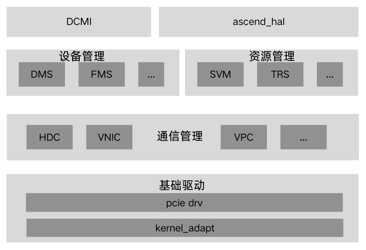

# driver
## 🔥Latest News
- [2025/12] driver项目首次上线。
## 🚀概述
Driver仓的代码是CANN（Compute Architecture for Neural Networks）的驱动模块，提供基础驱动和资源管理及调度等功能，使能昇腾芯片。当前开源仓内主要包含了如图所示三部分内容：DCMI层（DaVinci Card Management Interface，达芬奇卡管理接口层）、HAL层（Hardware Abstraction Layer，硬件抽象层）和SDK-driver层（Driver Software Development Kit，驱动软件开发套件层）。
<center>
    
</center>

## ⚡️快速入门
若您希望快速体验driver的调用和开发过程，请访问如下文档获取简易教程。
- [环境部署及编译构建](./docs/zh/build.md)：介绍不同形态驱动包的部署、编译构建。
- [参考用例](./examples/README.md)：介绍设备管理等模块基础用例。
## 🔍目录结构
关键目录结构如下：

```
├── build.sh                                       # 项目工程编译脚本
├── cmake                                          # 工程编译目录
├── CMakeLists.txt                                 # 项目工程CMakeList入口
├── CONTRIBUTING.md                                # 社区贡献指导
├── docs                                           # 说明文档
├── examples                                       # 接口使用样例
├── pkg_inc                                        # 本仓对外提供的头文件
├── LICENSES                                       # 本仓涉及协议目录
├── OAT.xml                                        # 配置脚本，代码仓工具使用，用于检查License是否规范
├── README.md
├── scripts                                        # 本仓脚本目录
│   └── package                                    # 构建打包相关脚本
├── SECURITY.md                                    # 项目安全声明文件
├── Third_Party_Open_Source_Software_Notice.txt    # 本仓引用的第三方开源软件声明
├── src                                            # Driver包源码
│   ├── ascend_hal                                 # HAL层源码文件夹
│   │   ├── ascend_base_hal                        # 昇腾基础公共接口目录
│   │   ├── bbox                                   # 黑匣子（Black Box，系统临终遗言）
│   │   ├── buff                                   # 进程间共享内存管理
│   │   ├── build                                  # ascend_hal动态库编译脚本
│   │   ├── commlib                                # 公共函数库
│   │   ├── dmc                                    # DMC（Device Maintenance Components）设备维护组件
│   │   │   ├── device_monitor                     # DSMI消息通路
│   │   │   ├── dsmi                               # DSMI（Device System Manage Interface）设备系统管理接口
│   │   │   ├── logdrv                             # Log日志
│   │   │   ├── prof                               # Profiling性能采集
│   │   │   └── verify_tool                        # 设备侧镜像校验工具
│   │   ├── dms                                    # DMS（Device Manage System）设备管理系统
│   │   ├── dpa                                    # DPA（Device Public Adapter）设备公共适配层
│   │   ├── esched                                 # 事件调度（Event Schedule）
│   │   ├── hdc                                    # 主机-设备通信（Host-Device Communication）
│   │   ├── inc                                    # HAL层内部公共头文件目录
│   │   ├── mmpa                                   # MMAP（Medium Multiple Platform Adaptive）基础系统接口库
│   │   ├── msnpureport                            # 设备侧维测信息导出工具
│   │   ├── pbl                                    # PBL（Public Base Lib）基础公共库
│   │   │   ├── uda                                # UDA（Unified Device Access）统一设备接入
│   │   │   └── urd                                # URD（User Request Distribute）用户请求转发
│   │   ├── queryfeature                           # 芯片特性查询
│   │   ├── queue                                  # 消息队列信息管理
│   │   ├── roce                                   # RoCE（RDMA over Converged Ethernet）
│   │   ├── svm                                    # 共享虚拟内存（Shared Virtual Memory）
│   │   ├── trs                                    # 任务资源调度（Task Resource Schedule）
│   │   └── tsdrv                                  # TS（Task Schedule）驱动外部依赖头文件
│   ├── custom                                     # 定制化特性源码库
│   │   ├── cmake                                  # CMake编译配置目录
│   │   ├── dev_prod                               # 设备定制管理目录
│   │   ├── include                                # 公共头文件导出目录
│   │   ├── lqdrv                                  # 灵渠PCIE故障检测
│   │   ├── ndr                                    # NPU RDMA直通特性
│   │   ├── network                                # DCMI网络接口实现
│   │   └── ops_debug                              # 算子诊断目录
│   └── sdk_driver                                 # SDK层源码文件夹
│       ├── buff                                   # 进程间共享内存管理
│       ├── comm                                   # Communication 主机侧<->设备侧通信层
│       ├── dmc                                    # DMC（Device Maintenance Components）设备维护组件
│       ├── dms                                    # DMS（Device Manage System）设备管理系统
│       ├── dpa                                    # DPA（Device Public Adapter）设备公共适配层
│       ├── esched                                 # 事件调度（Event Schedule）
│       ├── fms                                    # FMS（Fault Manage System）故障管理系统
│       ├── hdc                                    # 主机-设备通信（Host-Device Communication）
│       ├── inc                                    # SDK层内部公共头文件目录
│       ├── kernel_adapt                           # sdk驱动代码与内核源码适配层
│       ├── pbl                                    # PBL（Public Base Lib）基础公共库
│       ├── platform                               # 芯片资源（中断、预留内存等）存储库
│       ├── queue                                  # 消息队列信息管理
│       ├── svm                                    # 共享虚拟内存（Shared Virtual Memory）
│       ├── trs                                    # 任务资源调度（Task Resource Schedule）
│       ├── trsbase                                # 任务资源调度基础层
│       ├── ts_agent                               # TS（Task Schedule）代理驱动源码
│       ├── tsdrv                                  # TS软件sqcq通信、mailbox消息特性
│       ├── vascend                                # 昇腾算力切分特性
│       ├── vmng                                   # 设备虚拟化管理（Virtual Machine Manager）
│       ├── vnic                                   # VNIC（Virtual Network Interface Card）虚拟网卡
│       └── vpc                                    # VPC（Virtual Physical Communication）物理机与虚拟机通信
└── test                                           # 测试代码目录
```
## 📝相关信息
- [贡献指南](./CONTRIBUTING.md)
- [安全声明](./SECURITY.md)
- 许可证

[CANN Open Software License Agreement Version 2.0](./LICENSES/CANN-V2.0)

[GNU GENERAL PUBLIC LICENSE Version 2](./LICENSES/GPL-V2.0)
