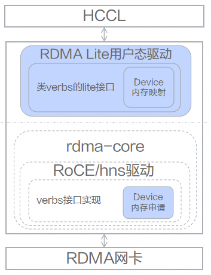

# RoCE

## 🚀概述

RoCE（RDMA over Converged Ethernet）基于[rdma-core](https://github.com/linux-rdma/rdma-core)开源框架实现的主要定制功能介绍：
- 控制面封装对应类verbs的lite接口，将Device内存映射到Host内存，支持在Host侧重建对应的上下文。
- 数据面封装对应类verbs的lite接口，可以基于重建的上下文直接在Host侧下发数据面操作，提升WR（Work Request）下发及轮询CQ（Complete Queue）的性能。

## 📝功能框架

    

- 功能框架中高亮部分对应driver仓中代码，包含以下两部分内容:
    - RDMA Lite用户态驱动：`src/ascend_hal/roce/host_lite/`
    - Device内存申请: `src/ascend_hal/roce/roce_hal_api/`

- 系统中的应用

    如调用：`rdma_lite_post_send(lite_qp, lite_send_wr, &lite_send_bad_wr, attr, &resp);`下发WR，可以通过在Host侧下发WR，达到直接将WR写入Device侧队列的目的。

    

- 应用场景举例

    上层集合通信库通过组合下发WR，如下发RDMA Write操作等，从而实现更高级的集合通信算子（例如：allgather等）。
