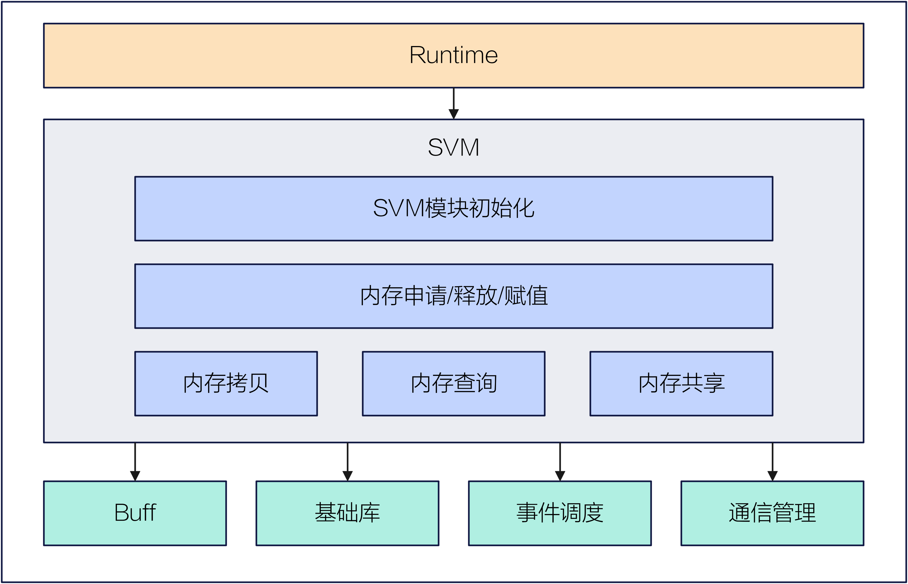
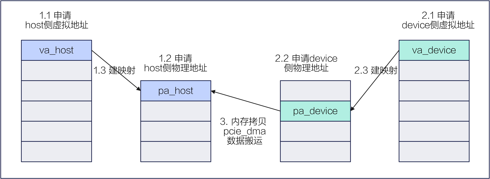
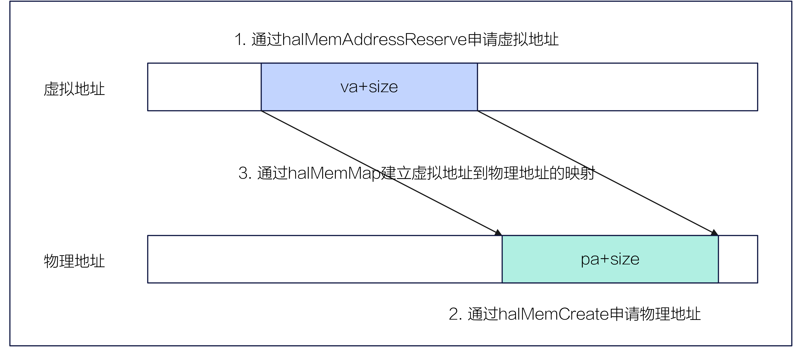

# SVM
## 整体介绍
SVM (Shared Virtual Memory) 是昇腾 AI 处理器平台中的内存管理模块，用于高效管理设备侧内存。其主要功能包括内存的初始化、申请、释放、拷贝、查询和共享等，并向上层模块（如 Runtime）提供 HAL 接口。

<center>
    
</center>


## SVM 初始化
SVM 接口 ：```halMemAgentOpen```
<br/>
APP 进程在初始化时会调用上层业务的初始化接口 ```aclrtSetDevice```，其中包含 SVM 模块的初始化流程。该流程主要包括：初始化 SVM 的模块管理结构体，并完成 Host 侧与 Device 侧 SVM 模块之间的交互。
## 内存申请/释放/赋值
SVM 接口：```halMemAlloc```/```halMemFree```/```drvMemsetD8```
<br/>
从预留的虚拟地址范围内分配并映射（通过 ```mmap```）一段虚拟地址，同时进入内核态申请物理页，并建立相应的页表项。释放时，则依次解除页表映射、释放物理页，并将虚拟地址归还至预留范围。内存赋值将指定大小的设备内存设置为给定的值。

此外，驱动还提供了 VMM 接口，允许开发者分别申请虚拟地址和物理地址，并根据需要动态建立它们之间的映射关系。
<br/>

- VMM 虚拟地址申请/释放
<br/>
SVM 接口 ：```halMemAddressReserve```/```halMemAddressFree```
<br/>
从预留的地址范围内分配并映射（通过 ```mmap```）一段虚拟地址，此时尚未真正分配物理页；释放时仅回收该虚拟地址。

- VMM 物理地址申请/释放
<br/>
SVM 接口 ：```halMemCreate```/```halMemRelease```
<br/>
在设备侧分配指定属性和大小的物理内存，并返回一个不透明的通用内存分配句柄，作为后续内存映射的引用标识；释放时，则释放该句柄所对应的物理内存。

- VMM 映射/解映射虚拟地址到物理地址
<br/>
SVM 接口 ：```halMemMap```/```halMemUnmap```
<br/>
建立或解除传入的虚拟地址与物理地址之间的映射关系。
## 内存查询
内存查询支持指定地址的内存属性查询和内存信息查询。

- 内存属性查询
<br/>
SVM 接口 ：```drvMemGetAttribute```
<br/>
获取传入虚拟地址的内存属性、物理页粒度等属性。

- 内存信息查询
<br/>
SVM 接口 ：```halMemGetInfo```
<br/>
查询设备侧的物理内存信息。
## 内存拷贝
SVM 接口 ：```halMemcpy```
<br/>
支持在主机与设备之间，或不同设备间进行内存数据传输。例如，在执行 H2D（Host-to-Device）传输时，会将数据从主机内存同步拷贝到设备内存。该同步拷贝操作是阻塞式的——调用方会一直等待，直到全部数据拷贝完成，才会返回并继续执行后续代码。
## 内存共享
内存共享支持不同设备间的内存共享，以及主机（Host）与设备（Device）之间的内存共享。

- 设备间内存共享
<br/>
SVM 接口 ：
```halShmemCreateHandle```/```halShmemDestroyHandle```
<br/>
```halShmemOpenHandleByDevId```/```halShmemCloseHandle```
<br/>
进程 1 创建一个指向共享设备内存的句柄；进程 2 通过解析该句柄，将其映射为本进程内的设备内存地址，从而实现对设备侧同一块物理内存的共享访问。销毁句柄和解除映射则分别执行相应的反向操作。

- host 和 device 间内存共享
<br/>
SVM 接口 ：```halHostRegister```/```halHostUnregister```
<br/>
将对端（Host 侧或 Device 侧）的内存对应注册到本端（Device 侧或 Host 侧），使本端能够直接访问或修改对端内存中的数据。
## SVM 在业务中的使用流程
#### 申请拷贝功能的业务使用流程
- 应用场景
<br/>
在算子运行前，其 Host 侧进程需先初始化 SVM 模块，然后调用 ```halMemAlloc``` 接口分别申请 Host 内存和 Device 内存，并获取对应的内存地址；随后，通过内存拷贝接口将待计算的数据从 Host 侧传输至 Device 侧。

- 业务调用 SVM 接口流程
1. 调用 ```halMemAlloc``` 接口申请 Host 内存，获取 Host 内存地址。
2. 调用 ```halMemAlloc``` 接口申请 Device 内存，获取 Device 内存地址。
3. 调用 ```halMemcpy``` 接口，将数据从 Host 内存同步拷贝至 Device 内存，完成数据搬运。

<center>
    
</center>

#### 内存共享功能的业务使用流程
- 应用场景
<br/>
业务模块在 Host 侧启动两个应用进程：host_app 进程 0 和 host_app 进程 1，分别对应设备 dev0 和 dev1。
<br/>
在算子执行过程中，dev0 将已完成的计算结果写入其本地设备内存。若后续计算需由 dev1 执行，则 dev1 可通过上述共享内存机制直接访问 dev0 的运算结果，无需经过 Host 中转或显式的数据拷贝，从而显著提升算子流水线的执行效率。

- 业务调用 SVM 接口流程
1. host_app 进程 0 调用 ```halMemAlloc``` 申请 dev0 上的设备内存，并通过 ```halShmemCreateHandle``` 接口创建该内存的共享句柄，随后将该句柄传递给 host_app 进程 1。
2. host_app 进程 1 调用驱动接口 ```halShmemOpenHandleByDevId``` 打开该共享句柄，驱动返回指向共享内存的指针，从而完成对 dev0 内存的映射。

<center>
    
</center>

#### VMM 功能的业务使用流程
- 应用场景
<br/>
基于 VMM 功能，业务模块可一次性申请所需的虚拟地址和物理地址，并根据实际需求动态建立映射关系，重复使用同一块物理内存，从而有效减少因物理内存频繁切分而导致的内存碎片。

- 业务调用 SVM 接口流程
<br/>

1. 调用```halMemAddressReserve```申请虚拟地址。
2. 调用```halMemCreate```申请物理地址。
3. 调用```halMemMap```建立虚拟地址到物理地址的映射。

<center>
    
</center>